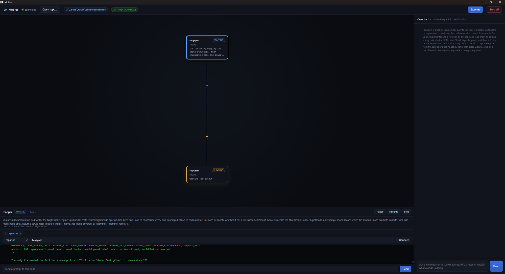

# Mobius

Program prompt loops over Claude Code. Mobius runs a graph of Claude agents that
feed each other and loop until done, keeps the whole graph queryable and
drivable, and puts a conductor Claude in a chat window so you can build, steer,
and interrogate the graph in plain English.

It is all Rust: a tokio host that owns the agent subprocesses and a hearsay bus, a
Leptos UI in a `wry` webview, and a programmable core you can drive from a plain
Rust program. The host is the point, so Mobius ships native.



## Run

```sh
just run       # the all-in-one desktop app: host plus UI in one window
just host      # just the host (bus, orchestrator, conductor, MCP)
just run-web   # the web UI in a browser; pair it with `just host`
just example   # a headless two-node loop driven from Rust
```

`just run` (and `just host`) need the `claude` CLI on your `PATH`. The first build
needs the pinned toolchain: `just init` (or install Rust 1.95 with the
`wasm32-unknown-unknown` target, plus `trunk`, `wasm-bindgen`, and `wasm-opt`).

## Hosted UI, local host

The host is the point: it owns your `claude` subprocesses and your repo, so it
runs on your machine. The UI is just a view, so it can live anywhere. The web UI
is deployed to GitHub Pages, and because it connects to the bus over a websocket
on `localhost` (which browsers treat as a secure context even from an https
origin), the public page drives the host running on your own machine. Clone the
repo, `just host`, open the page, and it connects. The desktop app bundles both
for a one-window local setup.

## Docs

- [docs/USAGE.md](docs/USAGE.md) - how to drive it: the conductor chat, staging
  and executing a graph by hand, the node inspector, and the headless Rust API.
- [docs/DESIGN.md](docs/DESIGN.md) - the architecture and the decisions: the
  crates, the bus and its topics, the graph model, the orchestrator, the
  conductor, and the MCP surface.

## License

Dual-licensed under either of [MIT](LICENSE-MIT) or [Apache-2.0](LICENSE-APACHE) at
your option.
